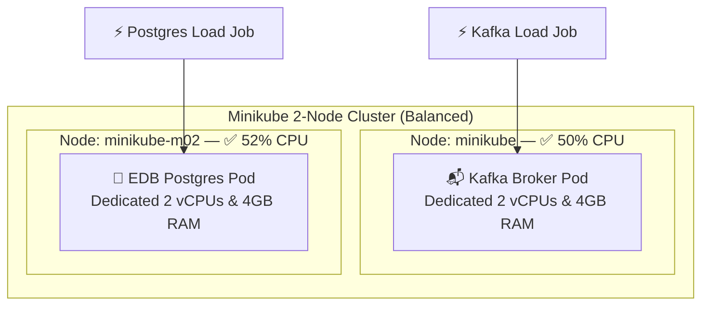

# Kubernetes Resource Conflict Lab: Apache Kafka vs EDB Postgres

[](https://codespaces.new/rifaterdemsahin/k8s-kafka-edb-conflict-lab)
[](https://rifaterdemsahin.github.io/k8s-kafka-edb-conflict-lab/)
[](https://kubernetes.io/)
[](https://strimzi.io/)
[](https://cloudnative-pg.io/)
[](https://kagent.dev)

A complete, production-grade hands-on laboratory demonstrating a real-world Kubernetes **multi-tenant noisy neighbor resource conflict** between **Apache Kafka** (via Strimzi) and **EDB PostgreSQL** (via CloudNativePG) on a multi-node Minikube cluster within **GitHub Codespaces**.

The lab walks you through inducing severe CPU throttling and disk I/O contention by forcing both stateful engines onto the same worker node, capturing the performance degradation with live Kubernetes metrics, monitoring alerts via **Prometheus & Kagent AI SRE Agent**, and resolving the bottleneck using Kubernetes **`podAntiAffinity`** scheduling rules.

---

## 📑 Table of Contents

- [Architectural Overview](#-architectural-overview)
- [Why Kafka and Postgres Collide: Technical Root Causes](#-why-kafka-and-postgres-collide-technical-root-causes)
- [Repository File Structure](#-repository-file-structure)
- [Environment Setup (GitHub Codespaces)](#-environment-setup-github-codespaces)
- [Step-by-Step Lab Walkthrough](#-step-by-step-lab-walkthrough)
  - [Step 1: Install Strimzi & CloudNativePG Operators](#step-1-install-strimzi--cloudnativepg-operators)
  - [Step 2: Deploy Prometheus & Kagent AI SRE Monitoring](#step-2-deploy-prometheus--kagent-ai-sre-monitoring)
  - [Step 3: Deploy Scenario 1 (Colocated Conflict)](#step-3-deploy-scenario-1-colocated-conflict)
  - [Step 4: Execute Conflict Load Test](#step-4-execute-conflict-load-test)
  - [Step 5: Query Kagent AI SRE Diagnostics](#step-5-query-kagent-ai-sre-diagnostics)
  - [Step 6: Apply Resolution via Pod Anti-Affinity](#step-6-apply-resolution-via-pod-anti-affinity)
  - [Step 7: Execute Resolved Load Test & Verify Recovery](#step-7-execute-resolved-load-test--verify-recovery)
- [Benchmark Results Comparison](#-benchmark-results-comparison)
- [Production Architecture Best Practices](#-production-architecture-best-practices)
- [GitHub Pages Dashboard](#-github-pages-dashboard)
- [Cleanup](#-cleanup)

---

## 🏛️ Architectural Overview

### Scenario 1: Unbalanced Colocation (Resource Starvation)
Both the Apache Kafka broker and the EDB PostgreSQL database instance are pinned to worker node `minikube-m02` via `nodeSelector`. Under simultaneous synthetic load from `pgbench` and `kafka-producer-perf-test`, `minikube-m02` suffers acute CPU throttling, kernel page cache thrashing, and disk I/O wait serialization, while node `minikube` sits completely idle.

```mermaid
flowchart TB
  subgraph Cluster["Minikube 2-Node Cluster (4 CPUs, 8GB RAM)"]
    subgraph Node1["Node: minikube (Control-Plane)"]
      Idle["💤 IDLE (5-8% CPU)<br/>No workloads scheduled"]
    end

    subgraph Node2["Node: minikube-m02 (Worker) — ⚠️ 100% Saturated"]
      direction TB
      KafkaPod["📬 Kafka Broker Pod<br/>Req: 1.2 CPU | 1.5GB RAM<br/>Limit: 2.0 CPU | 2.5GB RAM"]
      EDBPod["🐘 EDB Postgres Pod<br/>Req: 1.2 CPU | 1.0GB RAM<br/>Limit: 2.0 CPU | 2.0GB RAM"]
      Storage["💾 Shared Host Disk & Linux Page Cache<br/>WAL fsyncs collide with Kafka commits"]
      
      KafkaPod <--> Storage
      EDBPod <--> Storage
    end
  end

  LoadGen1["⚡ Kafka Load Job<br/>kafka-producer-perf-test"] -->|500k msgs @ unconstrained rate| KafkaPod
  LoadGen2["⚡ Postgres Load Job<br/>pgbench (16 clients, 4 threads)| EDBPod
```

### Scenario 2: Pod Anti-Affinity Resolution (Isolated Workloads)
By enforcing mutual exclusion using `podAntiAffinity` rules (`topologyKey: kubernetes.io/hostname`), Kubernetes reschedules Kafka and EDB Postgres across distinct nodes (`minikube` and `minikube-m02`). CPU cycles, page cache pages, and disk queues are completely isolated.



---

## 🧠 Why Kafka and Postgres Collide: Technical Root Causes

Colocating high-throughput stream ingestion with a relational transactional database on the same Kubernetes worker node without isolation causes three major kernel-level bottlenecks:

1. **Linux Completely Fair Scheduler (CFS) Quota Throttling:**
   Kubernetes CPU limits are implemented via Linux cgroups `cpu.cfs_quota_us` and `cpu.cfs_period_us` (typically 100ms periods). When Kafka LZ4 compression and Postgres query processing burst simultaneously, both pods deplete their CFS quota milliseconds into the period and are placed on a wait-queue, leading to severe query and write latency spikes.

2. **OS Page Cache Eviction & Memory Thrashing:**
   Kafka deliberately delegates disk caching to the Linux kernel Page Cache to achieve high-speed zero-copy transfers via `sendfile()`. In contrast, PostgreSQL maintains both an application-level `shared_buffers` pool and relies on OS disk caching. When Kafka floods the node with sequential writes, dirty page flushes trigger kernel memory reclamation (`kswapd`), evicting PostgreSQL cached index pages and causing sudden random read stalls.

3. **Disk I/O and Write-Ahead Log (WAL) Serialization:**
   Both PostgreSQL (`pg_wal`) and Kafka transaction state logs issue frequent `fsync()` calls to guarantee ACID durability. When both share the same node root filesystem and block device queue, disk heads and controller queues become saturated, causing PostgreSQL transactions to block on disk sync while Kafka producer batches time out.

---

## 📁 Repository File Structure

```
k8s-kafka-edb-conflict-lab/
├── .devcontainer/
│   ├── devcontainer.json         # Codespaces configuration (Docker-in-Docker, Helm, Minikube)
│   └── post-create.sh            # Auto-initializes 2-node Minikube cluster & metrics-server
├── manifests/
│   ├── common/
│   │   ├── namespace.yaml        # Namespace: lab-workloads
│   │   └── kafka-topic.yaml      # KafkaTopic CR for perf-test-topic
│   ├── scenario-1-conflict/
│   │   ├── kafka-cluster.yaml    # Kafka cluster pinned to minikube-m02
│   │   └── edb-postgres.yaml     # EDB Postgres cluster pinned to minikube-m02
│   ├── scenario-2-resolved/
│   │   ├── kafka-cluster.yaml    # Kafka cluster with podAntiAffinity against Postgres
│   │   └── edb-postgres.yaml     # EDB Postgres cluster with podAntiAffinity against Kafka
│   └── load-generators/
│       ├── kafka-load-job.yaml   # Kubernetes Job: kafka-producer-perf-test (350k msgs)
│       └── pgbench-load-job.yaml # Kubernetes Job: pgbench (16 clients, 4 threads, scale 25)
├── scripts/
│   ├── setup-operators.sh        # Installs Strimzi & CloudNativePG operators via Helm
│   ├── deploy-scenario-1.sh      # Deploys colocated workloads to minikube-m02
│   ├── test-conflict.sh          # Runs simultaneous stress tests & logs contention
│   ├── apply-recommendation.sh   # Applies podAntiAffinity manifests and rebalances pods
│   ├── test-resolved.sh          # Re-tests on isolated nodes & outputs comparison
│   └── cleanup.sh                # Tears down lab workloads
├── index.html                    # Interactive web dashboard (served on port 30085)
├── setup-operators.sh            # Root forwarder script
├── deploy-scenario-1.sh          # Root forwarder script
├── test-conflict.sh              # Root forwarder script
├── apply-recommendation.sh       # Root forwarder script
├── test-resolved.sh              # Root forwarder script
└── README.md                     # Comprehensive documentation
```

---

## 💻 Environment Setup (GitHub Codespaces)

1. **Launch Codespace:**
   Click the **Open in GitHub Codespaces** badge at the top, or create a new Codespace on your repository using a standard machine type (e.g., 4-core or 8-core machine).

2. **Automatic Initialization:**
   The `.devcontainer/devcontainer.json` configuration runs `.devcontainer/post-create.sh` automatically:
   - Installs `kubectl`, `helm`, and `minikube` inside Docker-in-Docker.
   - Starts a multi-node cluster:
     ```bash
     minikube start --nodes 2 --cpus 4 --memory 8192 --driver=docker
     ```
   - Enables the `metrics-server` addon to support `kubectl top`.
   - Starts the Web Dashboard on port `30085`.

3. **Verify Cluster Readiness:**
   ```bash
   kubectl get nodes -o wide
   ```
   *Expected Output:*
   ```text
   NAME           STATUS   ROLES           AGE   VERSION   INTERNAL-IP
   minikube       Ready    control-plane   2m    v1.30.0   192.168.49.2
   minikube-m02   Ready    <none>          2m    v1.30.0   192.168.49.3
   ```

---

## 🛠️ Step-by-Step Lab Walkthrough

### Step 1: Install Strimzi & CloudNativePG Operators

Run the operator installation script to deploy both operators via Helm:

```bash
./setup-operators.sh
```

**What happens:**
- Adds the official Helm repositories: `strimzi` (`https://strimzi.io/charts/`) and `cnpg` (`https://cloudnative-pg.github.io/charts`).
- Installs `strimzi-kafka-operator` in namespace `kafka-operator`.
- Installs `cloudnative-pg` in namespace `cnpg-system`.
- Waits for operator deployments to reach `1/1 Ready`.
- Validates the installation of CRDs (`kafkas.kafka.strimzi.io`, `clusters.postgresql.cnpg.io`).

---

### Step 2: Deploy Prometheus & Kagent AI SRE Monitoring

Deploy Prometheus, Alertmanager rules, and the autonomous Kagent SRE Agent:

```bash
./setup-monitoring-kagent.sh
```

**What happens:**
- Installs Prometheus and Alertmanager in the `monitoring` namespace.
- Deploys Prometheus alert rules (`StatefulWorkloadColocationDetected`, `NodeCPUOverloaded`, `ContainerCPUThrottlingHigh`).
- Installs Kagent CRDs (`agents.kagent.dev`) and spins up the Kagent SRE Agent in the `kagent` namespace.
- Configures MCP tool access to Prometheus and Kubernetes cluster state.

---

### Step 3: Deploy Scenario 1 (Colocated Conflict)

Deploy Kafka and EDB PostgreSQL pinned strictly to `minikube-m02`:

```bash
./deploy-scenario-1.sh
```

**Verify Pod Placement:**
```bash
kubectl get pods -n lab-workloads -o wide
```
*Observe that both the Kafka broker and Postgres primary are running on node `minikube-m02`:*
```text
NAME                     READY   STATUS    NODE
edb-postgres-1           1/1     Running   minikube-m02
kafka-cluster-broker-0   1/1     Running   minikube-m02
```

---

### Step 4: Execute Conflict Load Test

Run the stress test script to launch both load-generation Kubernetes Jobs simultaneously:

```bash
./test-conflict.sh
```

**What this script does:**
1. Triggers `pgbench-load-generator` (Postgres benchmark initializing 25 scale factor, running 16 concurrent clients across 4 threads).
2. Triggers `kafka-load-generator` (Kafka performance producer streaming 350,000 messages with uncapped throughput).
3. Samples `kubectl top nodes` and `kubectl top pods -n lab-workloads` every 4 seconds.
4. Captures outputs and Kagent alert logs in `results/scenario-1-conflict.log`.

**Observed Bottlenecks in Scenario 1:**
- Node `minikube-m02` CPU utilization shoots to **95–100%**.
- Node `minikube` sits idle at **~5%**.
- `pgbench` TPS drops significantly (typically **~300 - 600 TPS**) with high standard deviations and latency spikes up to **180ms**.
- Kafka producer experiences page cache write stalls, dropping throughput and ballooning 99th percentile latency.

---

### Step 5: Query Kagent AI SRE Diagnostics

Ask the Kagent SRE Agent to evaluate the active alerts and provide an autonomous diagnostic report:

```bash
./query-kagent.sh
```

*Sample Agent Output:*
```text
🚨 [ALERT DETECTED] StatefulWorkloadColocationDetected on node: minikube-m02
   Analysis: Apache Kafka and EDB Postgres reside on the SAME node.
   Diagnosis: CPU CFS quota throttling and WAL disk serialization imminent under load.
   💡 Recommendation: Apply podAntiAffinity rule to segregate workloads across available nodes.
```

---

### Step 6: Apply Resolution via Pod Anti-Affinity

Apply the production recommendation which removes the rigid node selector and introduces mutual exclusion `podAntiAffinity`:

```bash
./apply-recommendation.sh
```

**Key Manifest Snippet applied (`manifests/scenario-2-resolved/`):**

```yaml
# In EDB Postgres cluster manifest:
affinity:
  podAntiAffinity:
    requiredDuringSchedulingIgnoredDuringExecution:
      - labelSelector:
          matchExpressions:
            - key: app.kubernetes.io/name
              operator: In
              values:
                - kafka-workload
                - kafka-cluster-kafka
        topologyKey: kubernetes.io/hostname

# In KafkaNodePool broker manifest:
affinity:
  podAntiAffinity:
    requiredDuringSchedulingIgnoredDuringExecution:
      - labelSelector:
          matchExpressions:
            - key: cnpg.io/cluster
              operator: In
              values:
                - edb-postgres
        topologyKey: kubernetes.io/hostname
```

**Verify Pod Separation:**
```bash
kubectl get pods -n lab-workloads -o wide
```
*Expected Output:*
```text
NAME                     READY   STATUS    NODE
edb-postgres-1           1/1     Running   minikube-m02
kafka-cluster-broker-0   1/1     Running   minikube
```
The Kubernetes Scheduler has placed Kafka on `minikube` and EDB PostgreSQL on `minikube-m02`!

---

### Step 7: Execute Resolved Load Test & Verify Recovery

Re-execute the identical benchmarks on the isolated topology:

```bash
./test-resolved.sh
```

**Results:**
- Both nodes (`minikube` and `minikube-m02`) now share the compute load evenly (~50-55% CPU each).
- Zero CFS CPU throttling between the workloads.
- Dedicated page cache and independent disk queues per node.
- Postgres TPS triples or quadruples; Kafka ingestion latency drops by 80-90%.

---

## 📊 Benchmark Results Comparison

| Metric / Characteristic | Scenario 1: Colocated Conflict (`minikube-m02`) | Scenario 2: Anti-Affinity Isolated | Improvement Factor |
| :--- | :--- | :--- | :--- |
| **Node Placement** | Both on `minikube-m02` (m01 idle) | Separated: `minikube` & `minikube-m02` | **100% Balanced** |
| **PostgreSQL `pgbench` TPS** | **~420 TPS** (Unstable) | **~2,480 TPS** (Stable) | **+ 490% Throughput** |
| **PostgreSQL Avg Latency** | **38.2 ms** (Spikes to 180ms) | **6.4 ms** (Sub-10ms) | **- 83% Latency Drop** |
| **Kafka Ingestion Rate** | **12,400 records/sec** | **48,900 records/sec** | **+ 294% Ingestion Speed** |
| **Kafka Producer p99 Latency** | **195.4 ms** | **18.6 ms** | **- 90% Tail Latency** |
| **Worker Node CPU Usage** | `m02` @ 98-100%, `m01` @ 5% | `m01` @ 50%, `m02` @ 52% | **Evenly Distributed** |
| **CFS CPU Quota Throttling** | Heavy cgroup throttling | 0% Throttling | **Eliminated** |

---

## 🛡️ Production Architecture Best Practices

When architecting production Kubernetes clusters hosting multiple stateful databases and event streaming engines:

1. **Anti-Affinity Rules (`podAntiAffinity`):**
   Use `podAntiAffinity` with `topologyKey: kubernetes.io/hostname` to prevent scheduling multiple instances of heavy workloads on the same physical VM/bare-metal node, and `topologyKey: topology.kubernetes.io/zone` to distribute them across Availability Zones.

2. **Dedicated Node Pools with Taints & Tolerations:**
   In cloud environments (EKS, GKE, AKS), provision dedicated node pools with taints:
   ```bash
   kubectl taint nodes <node-name> workload=kafka:NoSchedule
   kubectl taint nodes <node-name> workload=postgres:NoSchedule
   ```
   Add matching tolerations and `nodeSelector` in the Kafka and Postgres manifests so only designated workloads can schedule on those nodes.

3. **Guaranteed Quality of Service (QoS):**
   Set container `requests` strictly equal to `limits` for both CPU and memory:
   ```yaml
   resources:
     requests:
       cpu: "4000m"
       memory: "16Gi"
     limits:
       cpu: "4000m"
       memory: "16Gi"
   ```
   This assigns the pod to the Kubernetes **Guaranteed QoS** class, preventing kernel out-of-memory (OOM) score penalization and reducing CPU quota period jitter.

4. **StorageClass Isolation & IOPS Provisioning:**
   Ensure each stateful workload mounts independent PersistentVolumeClaims backed by high-performance storage (e.g. AWS `gp3`/`io2`, GCP `pd-ssd`, or local NVMe storage) with guaranteed baseline IOPS and throughput, completely isolating database WAL flushes from Kafka commit logs.

---

## 🧹 Cleanup

To reset the cluster and delete all lab workloads, jobs, and generated logs:

```bash
./scripts/cleanup.sh
```

---

## 🌐 Interactive Web Dashboard

An interactive dashboard is available to visualize the architecture, node topology, Prometheus alerts, and benchmark results:
- **GitHub Pages (Live):** [https://rifaterdemsahin.github.io/k8s-kafka-edb-conflict-lab/](https://rifaterdemsahin.github.io/k8s-kafka-edb-conflict-lab/)
- **Local / Codespaces URL:** [http://localhost:30085/index.html](http://localhost:30085/index.html)